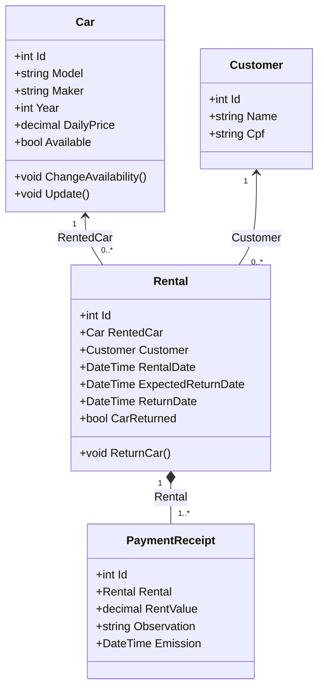

# CarRent

Projeto de API de locadora de carros utilizando C#, SQL Server, CQRS, MediatR, Fluent Validation e Identity Server 4.

## Diagrama de classes

```mermaid
classDiagram
    class Car {
        +int Id
        +string Model
        +string Maker
        +int Year
        +decimal DailyPrice
        +bool Available
        +void ChangeAvailability()
        +void Update()
    }

    class Customer {
        +int Id
        +string Name
        +string Cpf
    }

    class Rental {
        +int Id
        +Car RentedCar
        +Customer Customer
        +DateTime RentalDate
        +DateTime ExpectedReturnDate
        +DateTime ReturnDate
        +bool CarReturned
        +void ReturnCar()
    }

    class PaymentReceipt {
        +int Id
        +Rental Rental
        +decimal RentValue
        +string Observation
        +DateTime Emission
    }

    Car "1" <-- "0..*" Rental : RentedCar
    Customer "1" <-- "0..*" Rental : Customer
    Rental "1" *-- "1..*" PaymentReceipt : Rental
```
